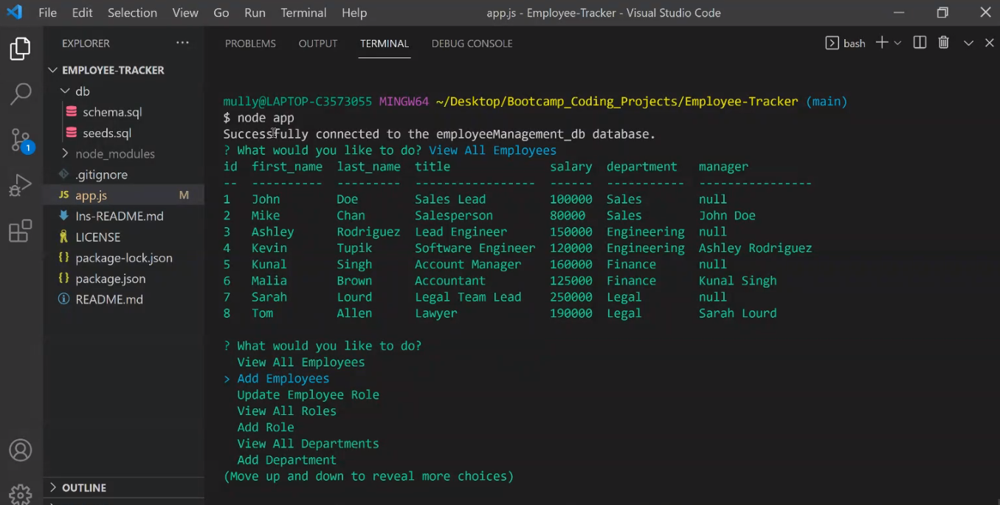

# Employee-Tracker
This is an employee tracker application I made using JavaScript and SQL.

 

This is a command line application that can be used to manage a company's employees. Users can view and manage the employees, departments, and roles.

## Installation

1.  Clone repository and use Node.js to run the application
2. Use `npm install` to install the required npm packages

## Usage

* To start using the application in VS Code, right-click the file schema.sql and click run in integrated terminal. After you've logged in to mysql use the following commands in the terminal:

source schema.sql
source seeds.sql

...to acquire the starting data.

* The application is invoked by running `node app.js` in the command line via the app.js terminal.

* Screenshot:

* [Video Demo]
https://watch.screencastify.com/v/OczxBC8FkUbzKtDc9Rao

* Website
  * [Github](https://github.com/Mully7773/Employee-Tracker)

## Features

* JavaScript
* Node.js
* MySQL
* npm packages
  * Inquirer
  * mysql2
  * console.table

## Author

Nick Mullenmeister
